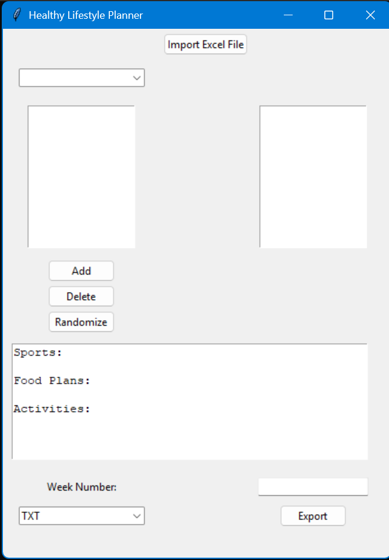
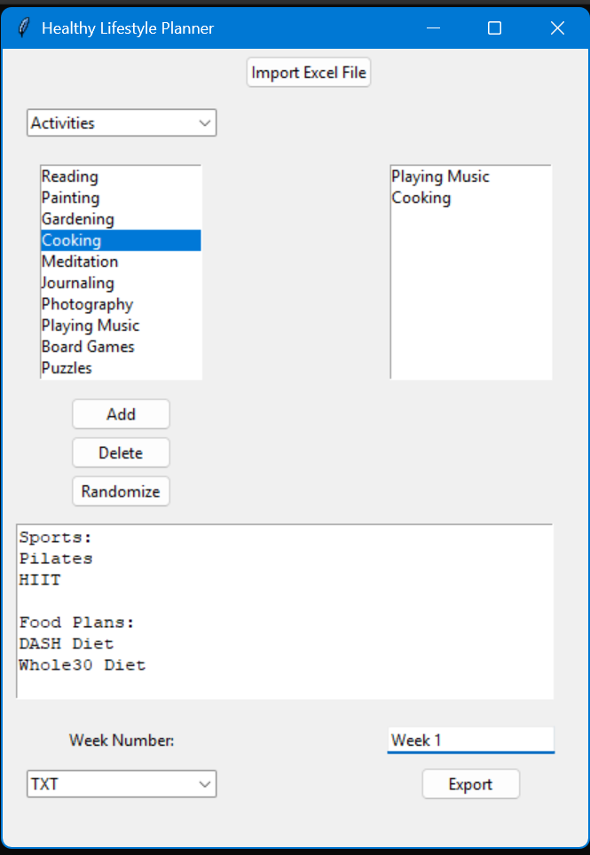

# 🥗 Healthy Lifestyle Planner

A desktop application built with Python and Tkinter that helps users plan their weekly sports activities, food plans, and daily activities. Users can import a custom Excel dataset, manually select items, or randomize a full 7-day plan — then export the result in TXT, JSON, or Excel format.

---

## 📸 Screenshots

> _Add a screenshot of the main window here_
> 
> 

> _Add a screenshot of a filled weekly plan here_
> 
> 

---

## ✨ Features

- 📂 **Import Excel Data** — Load your own categories (Sports, Food Plans, Activities) from a `.xlsx` file
- 🗂️ **Category Browser** — Browse available items per category using a dropdown + listbox
- ➕ **Manual Selection** — Add up to 7 items per category to your weekly plan
- 🎲 **Randomize** — Auto-generate a complete random 7-day plan in one click
- 🗑️ **Delete Items** — Remove individual selections from your plan
- 📤 **Export** — Save your plan for a specific week number as:
  - `.txt` — Plain text file
  - `.json` — Structured JSON
  - `.xlsx` — Formatted Excel spreadsheet with Day/Sport/Food/Activity columns

---

## 🛠️ Tech Stack

| Tool | Purpose |
|---|---|
| Python 3 | Core language |
| Tkinter | GUI framework |
| openpyxl | Excel file reading and writing |
| json | JSON export |

---

## 🚀 How to Run

1. **Clone the repository**
   ```bash
   git clone https://github.com/YourUsername/healthy-lifestyle-planner.git
   cd healthy-lifestyle-planner
   ```

2. **Install dependencies**
   ```bash
   pip install openpyxl
   ```

3. **Run the app**
   ```bash
   python healthy_lifestyle_planner.py
   ```

4. **Import an Excel file** with three columns: `Sports`, `Food Plans`, `Activities` (each with up to 26 items), then start building your plan!

---

## 📁 Excel File Format

Your input `.xlsx` file should follow this structure:

| Sports | Food Plans | Activities |
|---|---|---|
| Running | Mediterranean Diet | Reading |
| Swimming | Keto | Yoga |
| ... | ... | ... |

---

## 📤 Export Format Example (JSON)

```json
{
    "Sports": ["Running", "Swimming", ...],
    "Food Plans": ["Mediterranean Diet", ...],
    "Activities": ["Reading", "Yoga", ...]
}
```
